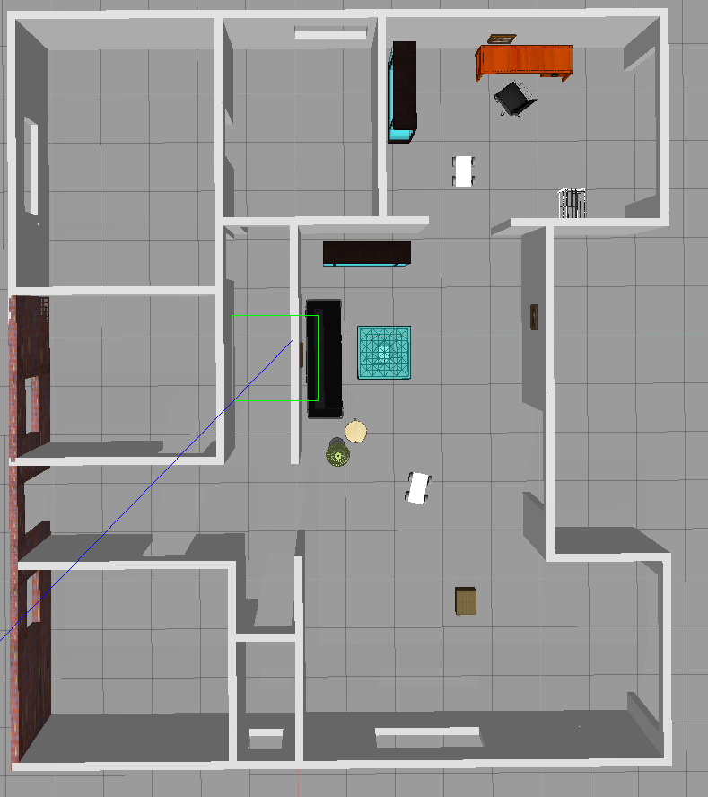

## Build My World

With `$PROJECT_ROOT` containing the clone destination directory

Build the plugin:

```shell
$ cd $PROJECT_ROOT
$ mkdir -p $PROJECT_ROOT/build
$ cd build/
$ cmake ../
$ make
```


Path the library/plugin

`
$ export GAZEBO_PLUGIN_PATH=${GAZEBO_PLUGIN_PATH}:$(pwd)/build
`

## Launch gazebo (after exporting the plugin path)
`$ gazebo world/housed_4_wheeled.world`



